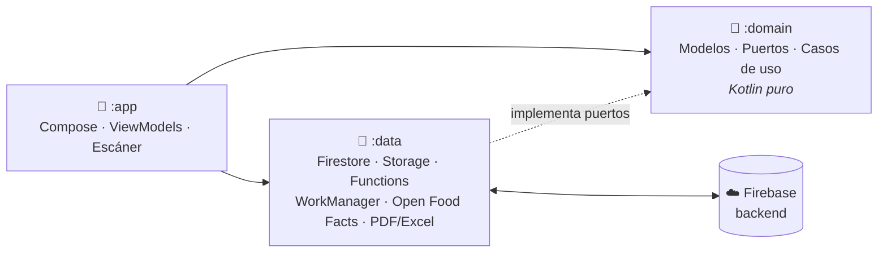

<div align="center">

# 🏪 Control Tienda

**App Android para administrar tiendas: catálogo, ventas con escáner, compras, inventario y reportes.**
Funciona sin conexión y se sincroniza en tiempo real cuando vuelve internet.

[](https://github.com/L-FER-GT/control_tienda_front/actions/workflows/android-ci.yml)


-3DDC84?logo=android&logoColor=white)


[Funcionalidades](#-funcionalidades) ·
[Stack](#-stack-tecnológico) ·
[Arquitectura](#-arquitectura) ·
[Inicio rápido](#-inicio-rápido) ·
[Documentación](#-documentación)

</div>

---

## ✨ Funcionalidades

| | |
|---|---|
| 🏬 **Multitienda** | Cada usuario crea una o varias tiendas (nombre, dirección, foto), públicas o privadas. |
| 👥 **Roles por tienda** | Administrador, empleado y cliente. El administrador delega módulos a sus empleados. |
| 🔢 **Código de 10 dígitos** | Cada usuario tiene un código para recibir invitaciones como empleado o cliente. |
| 🔔 **Invitaciones** | Notificación en la app y push; se aceptan o rechazan con un toque. |
| 📷 **Escáner** | Códigos de barras (EAN-13/8, UPC-A/E, Code 128…) y QR con CameraX + ML Kit, sin internet. |
| 🧾 **Crear orden** | Escaneo continuo sin duplicados, ítems manuales (kilo, litro, paquete…), método de pago y total. |
| 📦 **Catálogo** | Productos con foto, precio de venta, costo, stock, alerta de stock, código de barras y QR; categorías con foto y "Todos". |
| 💡 **Nombres automáticos** | Al registrar un código nuevo sugiere el nombre con Open Food Facts. |
| 🚚 **Compras** | Proveedores (RUC, asesor) y recepción de mercadería con fotos de facturas; suma stock y actualiza costos. |
| ⚠️ **Alertas de stock** | Productos en 0, negativos o bajo su mínimo. |
| 📈 **Reportes** | Ventas por periodo, empleado, método de pago y categoría; más vendidos, ganancias, compras e inventario valorizado. Exporta a **PDF** y **Excel**. |
| 📴 **Offline-first** | Base local + nube; ventas, productos y fotos se guardan sin conexión y se sincronizan solos. |
| 🛡️ **Opciones maestras** | El superadmin ve el consumo de Firebase frente a la cuota gratuita (alerta al 80 %) y puede deshabilitar usuarios o tiendas. |
| 📱 **Adaptable** | Celulares y tablets, en vertical y horizontal. |

## 🧰 Stack tecnológico

| Área | Tecnología | Para qué |
|---|---|---|
| Lenguaje e interfaz | Kotlin, Jetpack Compose, Material 3 | Pantallas de escaneo, búsqueda y administración |
| Arquitectura | Hexagonal + MVVM, Coroutines + Flow, Hilt | Separar la interfaz de los datos y facilitar las pruebas |
| Escáner | ML Kit Barcode Scanning con CameraX | Lectura continua de EAN-13, EAN-8, UPC-A, UPC-E y QR sin internet |
| Login | Firebase Authentication + Credential Manager | Google y correo/contraseña |
| Datos | Cloud Firestore con caché persistente | Catálogo compartido, tiempo real y consulta sin conexión |
| Archivos | Cloud Storage + WorkManager | Fotos y facturas (máx. 5 MB) con subida diferida |
| Nombres automáticos | Retrofit + kotlinx.serialization, API de Open Food Facts | Sugerir el nombre al registrar un código nuevo |
| CI/CD | GitHub Actions, Firebase CLI, Gradle Play Publisher | Pruebas, firma y entrega automáticas |
| Distribución | Firebase App Distribution (interno), Google Play (preparado) | Instalar y actualizar la app en los celulares |
| Pruebas | JUnit, Turbine, Firebase Emulator Suite | Probar dominio, ViewModels y reglas de seguridad |

## 🏛️ Arquitectura



- **`:domain`** no depende de Android ni de Firebase: contiene las reglas (carrito, alertas de stock,
  validaciones, filtros, generador de reportes) y se prueba con JUnit puro.
- **`:data`** implementa los puertos con Firebase y otros servicios.
- **`:app`** contiene solo la interfaz y su estado.

Más detalle en [docs/02-arquitectura.md](docs/02-arquitectura.md).

## 🚀 Inicio rápido

```bash
# 1. Backend local (otro repo): emuladores de Firebase
git clone https://github.com/L-FER-GT/control_tienda_backend.git
cd control_tienda_backend && npm install && npm run emulators

# 2. App
git clone https://github.com/L-FER-GT/control_tienda_front.git
cd control_tienda_front && git checkout develop
./gradlew :app:installDebug          # o Run ▶ en Android Studio
```

Sin `app/google-services.json` la app usa automáticamente el **emulador** (proyecto `demo-control-tienda`).
Para la nube, sigue [docs/03-configurar-firebase.md](docs/03-configurar-firebase.md).

```bash
./gradlew :domain:test :app:testDebugUnitTest   # pruebas
```

## 🗂️ Estructura

```
control_tienda_front/
├── app/        Interfaz: Compose, ViewModels, navegación, escáner, notificaciones
├── data/       Adaptadores: Firebase, subidas, Open Food Facts, PDF/Excel
├── domain/     Núcleo: modelos, puertos y casos de uso (Kotlin puro)
├── config/     google-services.demo.json (emulador)
├── docs/       Guías paso a paso
└── .github/    Workflows de CI/CD y Dependabot
```

## 📚 Documentación

| Guía | Contenido |
|---|---|
| [01 · Entorno de desarrollo](docs/01-entorno-de-desarrollo.md) | Requisitos, emulador vs. nube, comandos |
| [02 · Arquitectura](docs/02-arquitectura.md) | Capas, módulos, patrones y pruebas |
| [03 · Configurar Firebase](docs/03-configurar-firebase.md) | Registrar la app, SHA, login con Google, `google-services.json` |
| [04 · Firma de la app](docs/04-firma-de-la-app.md) | Crear el keystore y usarlo local y en CI |
| [05 · CI/CD](docs/05-ci-cd.md) | Ramas, workflows, environments y versionado |
| [06 · App Distribution](docs/06-firebase-app-distribution.md) | Grupos de testers, cuenta de servicio, instalación |
| [07 · Google Play](docs/07-google-play.md) | Pasos para publicar cuando se decida |
| [08 · Credenciales y secretos](docs/08-credenciales-y-secretos.md) | Qué es cada credencial, dónde se obtiene y dónde se guarda |
| [09 · Flujos de la app](docs/09-flujos-de-la-app.md) | Roles, invitaciones, órdenes, inventario |
| [10 · Funcionamiento offline](docs/10-funcionamiento-offline.md) | Base local, "sala" de la tienda, archivos |

## 🌿 Ramas

| Rama | Uso | Entrega |
|---|---|---|
| `master` | **Producción** | App Distribution (grupo `produccion`) · Google Play cuando se active |
| `develop` | Integración | App Distribution (grupo `testers`) |
| `feature/*` | Desarrollo | Pruebas + APK debug como artefacto |

## 🔗 Repositorios

- 📱 **App Android** — este repositorio
- ☁️ **Backend Firebase** — [control_tienda_backend](https://github.com/L-FER-GT/control_tienda_backend): reglas de seguridad, índices, Cloud Functions, superadmin y alertas de consumo

---

<div align="center">
Hecho con Kotlin y ☕ en Perú · Uso interno
</div>
