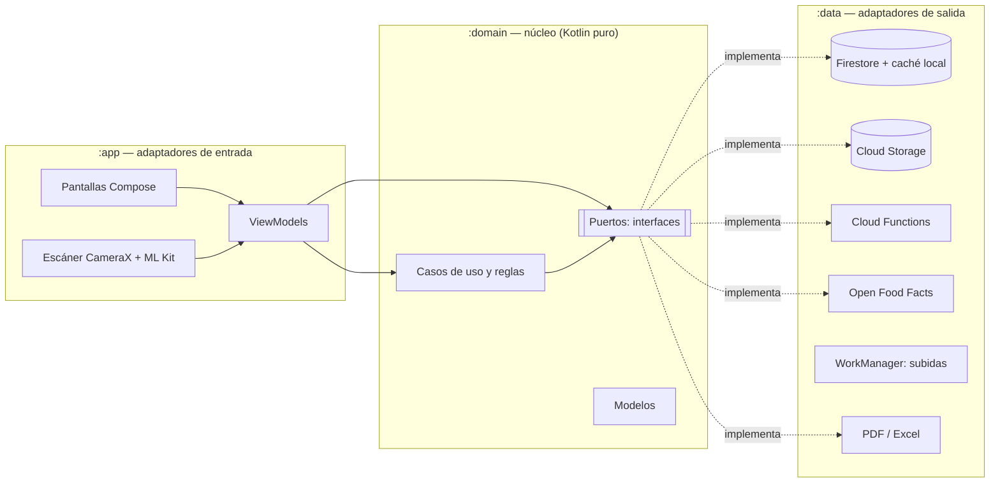

# 2. Arquitectura

La app sigue **arquitectura limpia hexagonal** (puertos y adaptadores) con **MVVM** en la interfaz.



## Módulos

| Módulo | Tipo | Depende de | Contenido |
|---|---|---|---|
| `:domain` | Kotlin/JVM puro | nada de Android ni Firebase | Modelos, puertos (`port/`), casos de uso y reglas (`usecase/`), errores |
| `:data` | Android library | `:domain` | Adaptadores: repositorios Firebase, subidas con WorkManager, Open Food Facts (Retrofit), exportador de reportes, conectividad |
| `:app` | Android application | `:domain`, `:data` | Compose + Material 3, ViewModels (Hilt), navegación tipada, escáner, notificaciones push |

La regla de dependencias es estricta: **el dominio no conoce a nadie**. Los ViewModels dependen de
puertos (interfaces) y casos de uso; Hilt inyecta las implementaciones de `:data`
(ver [`DataModule.kt`](../data/src/main/java/com/lfergt/controltienda/data/di/DataModule.kt)).

## Dónde está cada cosa

```
domain/src/main/kotlin/.../domain
├── model/        Store, Product, Order, Reception, Permission, Money, ReportTable…
├── port/         AuthRepository, CatalogRepository, OrderRepository, ReportExporter… (puertos)
├── usecase/      OrderCart, ScanDebouncer, StockAlerts, ProductValidator, ReportGenerator,
│                 StoreListFilters, CreateOrderUseCase, InviteMemberUseCase…
└── error/        DomainError (mensajes en español)

data/src/main/java/.../data
├── di/           Firebase (caché persistente, emuladores) y bindings puerto -> adaptador
├── firebase/     Mappers documento <-> modelo, flows de listeners, traducción de errores
├── repository/   Implementaciones de los puertos
├── media/        Compresión de imágenes, cola de subida (WorkManager), URLs de Storage
├── openfoodfacts/ API para sugerir nombres por código de barras
├── report/       PDF (PdfDocument) y Excel (.xlsx mínimo sin librerías)
└── system/       Conectividad, errores de sincronización, usuario actual

app/src/main/java/.../
├── feature/      auth, home, store, members, notifications, profile, master,
│                 catalog, orders, scanner, purchasing, stock, reports
├── navigation/   Rutas tipadas (@Serializable) y NavHost
└── ui/           Tema, componentes (cajas, barras ancladas, formularios), carga de imágenes
```

## Patrones en la interfaz

- **MVVM + Flow:** cada pantalla tiene un `ViewModel` que expone un `StateFlow` con el estado y un
  canal de mensajes de una sola vez (snackbar) heredado de `BaseViewModel`.
- **Navegación tipada:** rutas `@Serializable` en [`Routes.kt`](../app/src/main/java/com/lfergt/controltienda/navigation/Routes.kt).
  Dentro de una tienda, el primer nivel muestra el nombre de la tienda y el segundo nivel el
  nombre del módulo ("Ver productos", "Mis ventas", "Categorías", "Reportes").
- **Diseño adaptable:** grillas `GridCells.Adaptive` (2 columnas en celular vertical, más en
  tablet u horizontal), formularios con ancho máximo y landing en dos columnas cuando el celular
  está en horizontal.
- **Permisos en la interfaz y en el servidor:** la UI oculta lo que el rol no permite, pero la
  seguridad real está en las reglas de Firestore/Storage del backend.

## Pruebas

| Capa | Herramientas | Ejemplos |
|---|---|---|
| Dominio | JUnit | `OrderCartTest`, `ReportGeneratorTest`, `StoreRulesTest`, `CatalogRulesTest` |
| ViewModels | JUnit + Turbine + coroutines-test + dobles de puertos | `CreateOrderViewModelTest`, `HomeViewModelTest` |
| Reglas de seguridad | Firebase Emulator Suite (repo backend) | `tests/rules/*.test.ts` |

Ver también [10-funcionamiento-offline.md](10-funcionamiento-offline.md).
