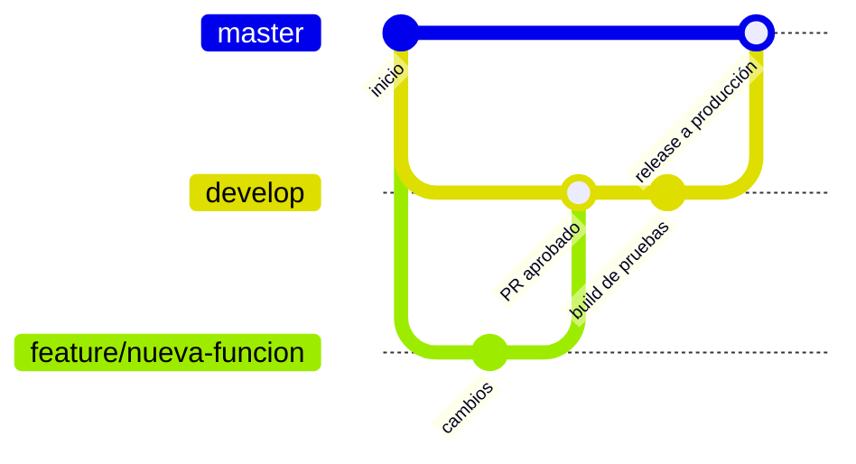

# 5. CI/CD con GitHub Actions

## Ramas



| Rama | Propósito | Qué se ejecuta |
|---|---|---|
| `feature/*` | Desarrollo de cada funcionalidad | Pruebas + APK debug |
| `develop` | Integración y pruebas | Pruebas + APK firmado a **App Distribution** (grupo `testers`) |
| `master` | **Producción** | Pruebas + APK/AAB firmados → App Distribution (grupo `produccion`) y, si se habilita, Google Play |
| tags `v*` | Versión numerada | Igual que `master` + GitHub Release con el APK y el AAB |

Flujo recomendado: `feature/*` → Pull Request a `develop` → probar con testers → Pull Request de
`develop` a `master`.

## Workflows

| Archivo | Disparador | Secretos |
|---|---|---|
| [`android-ci.yml`](../.github/workflows/android-ci.yml) | PR a develop/master, push a `feature/**` | Ninguno |
| [`android-distribute.yml`](../.github/workflows/android-distribute.yml) | push a `develop` | environment `pruebas` |
| [`android-release.yml`](../.github/workflows/android-release.yml) | push a `master`, tags `v*` | environment `produccion` |

## Configurar los environments

GitHub → repo → **Settings → Environments → New environment**. Crea `pruebas` y `produccion`
(en `produccion` puedes activar *Required reviewers* para aprobar cada release).

En **cada** environment agrega estos secretos (detalle en [08-credenciales-y-secretos.md](08-credenciales-y-secretos.md)):

- `GOOGLE_SERVICES_JSON_BASE64`
- `ANDROID_KEYSTORE_BASE64`, `ANDROID_KEYSTORE_PASSWORD`, `ANDROID_KEY_ALIAS`, `ANDROID_KEY_PASSWORD`
- `FIREBASE_SERVICE_ACCOUNT_JSON`
- `PLAY_SERVICE_ACCOUNT_JSON` (solo `produccion`, opcional hasta publicar en Play)

Variables opcionales (**Settings → Secrets and variables → Actions → Variables**):

| Variable | Por defecto | Uso |
|---|---|---|
| `APP_DISTRIBUTION_GROUPS_DEV` | `testers` | Grupo(s) que reciben los builds de `develop` |
| `APP_DISTRIBUTION_GROUPS_PROD` | `produccion` | Grupo(s) que reciben los builds de `master` |
| `PLAY_PUBLISH_ENABLED` | (vacía) | Ponla en `true` para publicar en Google Play |

## Versionado

- `versionCode`: minutos transcurridos desde 2020-01-01 al compilar. Siempre crece y es el mismo
  criterio en `develop` y `master`, así los testers pueden instalar encima sin desinstalar.
- `versionName`: `1.0.<n>-dev` en develop, `1.0.<n>` en master o el nombre del tag (`v1.2.0`).

## Publicar una versión

```bash
git checkout master && git merge --no-ff develop
git tag v1.0.0
git push origin master --tags
```
