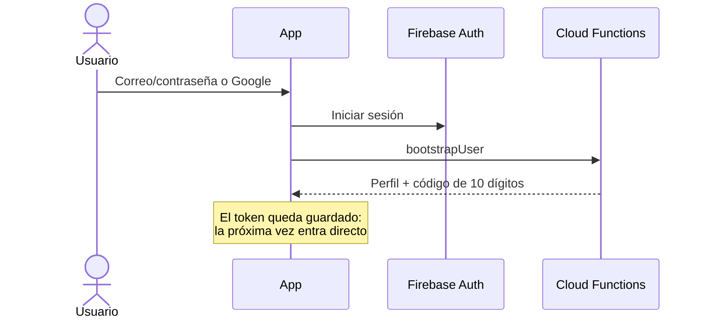
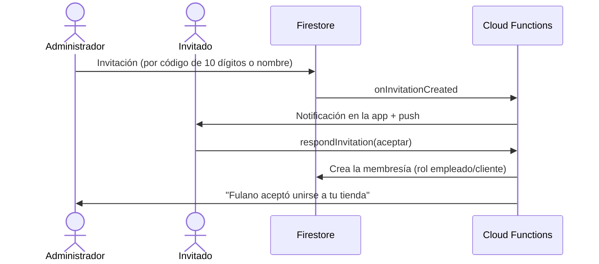

# 9. Flujos de la app

## Roles (por tienda)

Un mismo usuario puede ser administrador de su tienda, empleado en otra y cliente en otra.

| Opción del landing | Cliente / visitante | Empleado | Administrador (dueño) |
|---|:---:|:---:|:---:|
| Ver productos (foto, nombre, precio) | ✅ | ✅ | ✅ |
| Ver inventario | — | 🔑 | ✅ |
| Crear orden | — | ✅ | ✅ |
| Mis ventas | — | ✅ | ✅ |
| Gestionar productos | — | 🔑 | ✅ |
| Categorías | — | 🔑 | ✅ |
| Reportes | — | 🔑 | ✅ |
| Alertas de stock mínimo | — | 🔑 | ✅ |
| Proveedores | — | 🔑 | ✅ |
| Recepción de mercadería | — | 🔑 | ✅ |
| Empleados y clientes | — | 🔑 | ✅ |
| Editar tienda | — | 🔑 | ✅ |

🔑 = solo si el administrador le dio ese permiso. Cada tienda tiene **un** administrador; para
tener "otro administrador" se le dan todos los permisos a un empleado.

El **superadmin** (creador de la app) además ve **Opciones maestras** en el menú del avatar:
consumo de Firebase frente a las cuotas gratuitas, y habilitar o deshabilitar usuarios y tiendas.

## Primer ingreso

## Lista de tiendas

- Cajas con la foto ocupando todo y el nombre abajo.
- Filtros: **Mi(s) tienda(s)** (solo si tienes alguna, y es el filtro por defecto), **Puestos de
  trabajo** (solo si eres empleado en alguna) y **Todas** (públicas + las que te dieron acceso).
- Arriba a la derecha: notificaciones y avatar (Configuración, Opciones maestras, Cerrar sesión).
  Dentro de una tienda ya no se muestran.

## Invitar empleados o clientes

En **Notificaciones** cada invitación muestra quién la envió, el título y el contenido, con los
botones **Aceptar** / **Rechazar**; al aceptar aparece **Ir a la tienda**.

## Crear orden

1. Botón **+** (esquina inferior derecha) → *Escanear código de barras*, *Escanear QR* o *Introducción manual*.
2. Al escanear se dibuja un cuadro de enfoque; debajo, con margen, un recuadro blanco con letras
   negras muestra el nombre y precio del producto leído. Leer el mismo código de forma continua no lo
   duplica: para sumar otra unidad se retira y se vuelve a enfocar.
3. Código no registrado: *Ingresar manual* o *Registrar* el producto (si tiene permiso).
4. Manual: detalle, categoría, precio y cantidad (unidades, kilos, litros, paquetes…). No afecta inventario.
5. Resumen editable, total, método de pago (informativo) y **Registrar venta**.
6. Funciona sin conexión: la venta queda "Pendiente" y al sincronizar el servidor le asigna el
   número correlativo y descuenta el stock.

## Categorías

- Siempre existe **Todos** (todos los productos sin excepción).
- Dentro de una categoría, el botón **+** ofrece *Productos sin categoría* y *Todos los productos*.
  Si un producto ya pertenece a otra categoría se pide confirmación:
  *"X ya está en la categoría Y. ¿Estás seguro que deseas cambiarlo?"*

## Inventario

| Evento | Efecto en stock |
|---|---|
| Venta concretada | Resta (puede quedar negativo; las ventas nunca se bloquean) |
| Ítem manual | Ninguno |
| Recepción de mercadería | Suma; al editarla se aplica solo la diferencia |
| Producto con stock vacío | Ilimitado: no se modifica ni se alerta |

**Alertas de stock mínimo:** productos con stock en 0 o negativo, y los que tienen *alerta de stock*
y llegaron a ese mínimo.

## Precios con historial

Cada producto guarda el historial de precio de venta y costo de compra (creación, ediciones y
recepciones). Cada venta guarda el precio y el costo vigentes en ese momento, así los reportes de
ganancia son correctos aunque los precios cambien varias veces en la semana.
