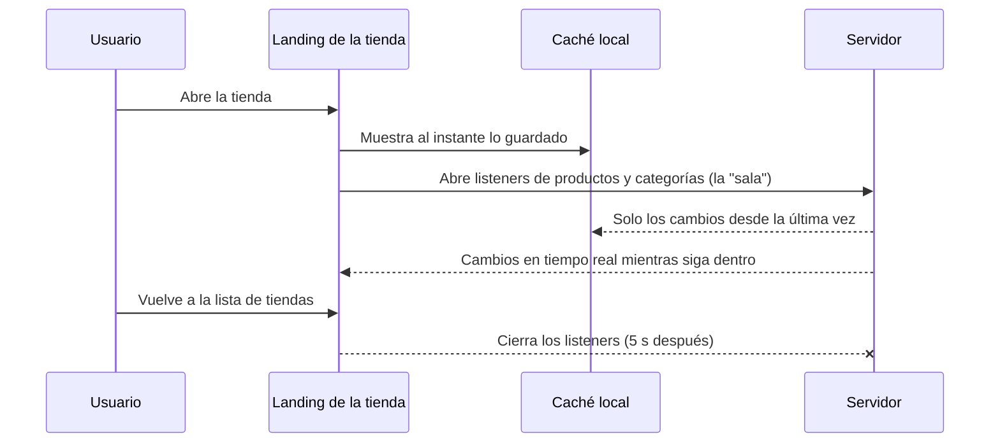

# 10. Funcionamiento sin conexión y sincronización

## Base de datos en la nube + base local

- **Nube:** Cloud Firestore.
- **Local:** la caché persistente de Firestore en el celular, sin límite de tamaño
  ([`FirebaseModule.kt`](../data/src/main/java/com/lfergt/controltienda/data/di/FirebaseModule.kt)).
- Cada documento guarda `updatedAt` (fecha de actualización). Firestore solo descarga lo que
  cambió desde la última sincronización.

## "Entrar a la sala" de la tienda

- La actualización se busca **solo al entrar a la tienda**.
- Solo se reciben cambios de **la tienda en la que se está**: al salir se cierran los listeners.
- Todas las pantallas de una misma tienda comparten un único listener por colección
  ([`CatalogRepositoryImpl`](../data/src/main/java/com/lfergt/controltienda/data/repository/CatalogRepositoryImpl.kt)).

## Escrituras sin conexión

| Acción | Sin conexión | Al reconectar |
|---|---|---|
| Crear tienda, producto, categoría, proveedor | ✅ Se guarda local | Se envía al servidor |
| Crear orden de venta | ✅ Queda "Pendiente" | El servidor asigna el número y descuenta stock |
| Recepción de mercadería | ✅ | El servidor suma stock y actualiza costos |
| Fotos y archivos | ✅ Se ven desde la copia local | WorkManager los sube (límite 5 MB, comprimidos) |
| Aceptar invitación, eliminar cuenta, opciones maestras | ❌ Requiere conexión | — |
| Reportes | ⚠️ Con lo que haya en la caché | Datos completos con conexión |

Si el servidor rechaza un cambio hecho sin conexión (por ejemplo, el administrador te quitó un
permiso mientras tanto), la app muestra un aviso y la caché local se corrige sola.

## Archivos ("carpeta del servidor")

- Se guardan en **Cloud Storage** con nombre aleatorio (UUID). Firestore guarda **solo la ruta**,
  p. ej. `stores/abc/products/9f3c….jpg`.
- Límite de **5 MB por archivo**, validado en la app y en las reglas de Storage. Las fotos se
  reducen a 1600 px y se comprimen a JPEG.
- Las imágenes descargadas quedan en una caché de disco de 250 MB: se siguen viendo sin conexión.
- Al reemplazar una foto, una Cloud Function borra la anterior para no pagar almacenamiento de más.
